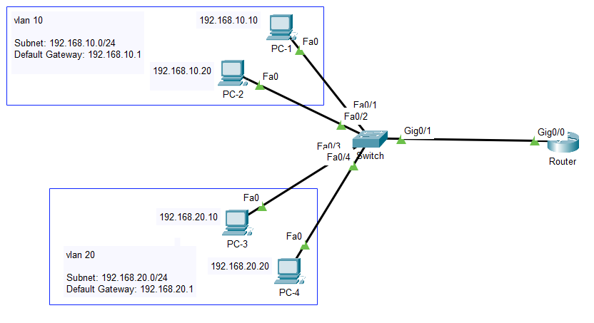

# 🌐 VLAN & Router-on-a-Stick Implementation

[](https://opensource.org/licenses/MIT)
[](https://obkworks.com)
[](https://obkworks.com)

> Hands-on Cisco networking lab implementing Layer 2 segmentation using Virtual Local Area Networks (VLANs) and Inter-VLAN routing via the Router-on-a-Stick method (IEEE 802.1Q standard).

---

## ℹ️ Overview

The concept of a Virtual Local Area Network (VLAN) is used to logically separate broadcast domains at Layer 2. Communication between separate VLANs requires a Layer 3 device. The **Router-on-a-Stick** method, using logical subinterfaces over a single physical trunk link, provides Inter-VLAN routing in the most efficient and cost-effective way.

---

## 🖼️ Network Topology



---

## 📚 1. Core Concepts

- **Broadcast Domain Isolation:** Each VLAN creates a separate broadcast domain — broadcast traffic from one VLAN never leaks into another.
- **Logical Segmentation:** Group users logically by department or security level, independent of their physical switch connection.
- **Access vs. Trunk Ports:** Access ports carry untagged traffic for a single VLAN (end systems); Trunk ports carry tagged traffic for multiple VLANs (802.1Q).
- **IEEE 802.1Q Tagging:** Adds a 4-byte VLAN header to Ethernet frames crossing trunk links.
- **Inter-VLAN Routing:** Layer 2 switches cannot route between isolated VLANs, making a Layer 3 router or multilayer switch necessary for communication.

---

## 📐 2. Network Topology & Addressing Scheme

The logical network infrastructure consists of two separate segments:

| Department    |  VLAN ID  | Subnet / Network  | Default Gateway | Client Devices                                 |
| :------------ | :-------: | :---------------: | :-------------: | :--------------------------------------------- |
| **Sales**     | `VLAN 10` | `192.168.10.0/24` | `192.168.10.1`  | PC-1 (`192.168.10.10`), PC-2 (`192.168.10.11`) |
| **Marketing** | `VLAN 20` | `192.168.20.0/24` | `192.168.20.1`  | PC-3 (`192.168.20.10`), PC-4 (`192.168.20.11`) |

---

## 🔌 3. Physical Connections

| Source Device   | Source Port         | Destination Device | Destination Port       | Link Mode / Type      |
| :-------------- | :------------------ | :----------------- | :--------------------- | :-------------------- |
| **PC-1 / PC-2** | Ethernet0           | **Switch (S1)**    | FastEthernet 0/1 - 0/2 | Access mode (VLAN 10) |
| **PC-3 / PC-4** | Ethernet0           | **Switch (S1)**    | FastEthernet 0/3 - 0/4 | Access mode (VLAN 20) |
| **Switch (S1)** | GigabitEthernet 0/1 | **Router (R1)**    | GigabitEthernet 0/0    | Trunk mode (802.1Q)   |

---

## ⚙️ 4. Switch Configuration Commands

```cisconetworking
! Define VLANs
S1# configure terminal
S1(config)# vlan 10
S1(config-vlan)# name Sales
S1(config-vlan)# vlan 20
S1(config-vlan)# name Marketing
S1(config-vlan)# exit

! Assign Access Ports to VLAN 10
S1(config)# interface range FastEthernet 0/1 - 2
S1(config-if-range)# switchport mode access
S1(config-if-range)# switchport access vlan 10
S1(config-if-range)# exit

! Assign Access Ports to VLAN 20
S1(config)# interface range FastEthernet 0/3 - 4
S1(config-if-range)# switchport mode access
S1(config-if-range)# switchport access vlan 20
S1(config-if-range)# exit

! Configure Uplink Trunk Port to Router
S1(config)# interface GigabitEthernet 0/1
S1(config-if)# switchport mode trunk
S1(config-if)# end
S1# write memory
```

---

## 🚀 5. Router Configuration (Router-on-a-Stick)
```
! Enable Physical Interface
R1# configure terminal
R1(config)# interface GigabitEthernet 0/0
R1(config-if)# no shutdown
R1(config-if)# exit

! Subinterface for VLAN 10 (Sales Gateway)
R1(config)# interface GigabitEthernet 0/0.10
R1(config-subif)# encapsulation dot1Q 10
R1(config-subif)# ip address 192.168.10.1 255.255.255.0
R1(config-subif)# exit

! Subinterface for VLAN 20 (Marketing Gateway)
R1(config)# interface GigabitEthernet 0/0.20
R1(config-subif)# encapsulation dot1Q 20
R1(config-subif)# ip address 192.168.20.1 255.255.255.0
R1(config-subif)# end
R1# write memory
```

---

## 🔍 6. Verification & Troubleshooting Commands

1. Verify VLAN Assignment on Switch:
```S1# show vlan brief```

2. Verify Trunk Link Status:
```S1# show interfaces trunk```

3. Check Active Connected Routes on Router:
```R1# show ip route```

4. End-to-End Connectivity Ping Test:
```PC-1> ping 192.168.20.10```

---

## ⚠️ 7. Common Pitfalls
Unsaved Configuration: Forgetting write memory causes settings loss after reload.

Native VLAN Mismatch: Mismatched native VLANs trigger CDP warnings and leak untagged traffic.

Dot1Q VLAN ID Mismatch: The subinterface encapsulation VLAN ID must strictly match the switch VLAN ID.

Access vs. Trunk Port Errors: Setting the router uplink to access mode completely breaks multi-VLAN routing.

Gateway Mismatch: Incorrect IP gateway settings on client PCs prevent cross-VLAN communication.

---

## 🏁 8. Technical Conclusion
This scenario demonstrates the foundational principles of Inter-VLAN Routing using the Router-on-a-Stick method. While optimal for small-to-medium topologies, large enterprise environments often migrate toward Layer 3 Switch (SVI) architectures to overcome single-trunk bandwidth bottlenecks using ASIC hardware switching performance.

🔗 Live Portfolio Demo: Coming soon

📄 License: MIT License — © 2026 obkWorks
